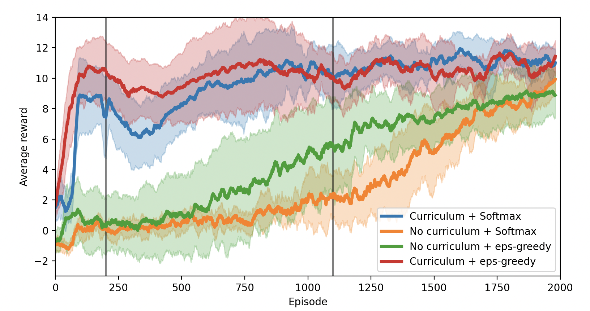

_Part of [SHKYERA](https://youtu.be/Kb4bNZGqKyE) project_

## _Still in development_


# Rocket Landing - Reinforcement Learning

## Environment

I made a custom OpenAI-Gym environment with fully functioning 2D physics engine. If you want to test your own algorithms using that, download the package by simply typing in terminal (not yet :))

```
pip install rocket-landing-gym
```

All the environment's functionalities are described [here](url).

### Minimal usage

```python
from rocketgym import Environment

import random

env = Environment()
observation = env.reset()
done = False

while not done:
    new_observation, reward, done = env.step(random.randint(0,3))
    observation = new_observation
    env.render()
```

## Learning

In the `train.py` you can see, how agent training is implemented. All you need to do is specify the exploration strategy and adjust the environment to your needs. More info about adjusting the environment and learning process is [here](url). I found that it takes around 2000 iterations to learn to land without any curriculum learning, but the process can be significantly sped up by setting up a task difficulty schedule. This can be easily done through the `Curriculum` module.

## Diagnostics

If you want to make pretty plots, like this one

feel free to use `diagnostics.py`. All you need to know to do that is described in the script itself.

_**For a detailed explanation of the environment and the learning algorithms I used, see [here](url).**_
